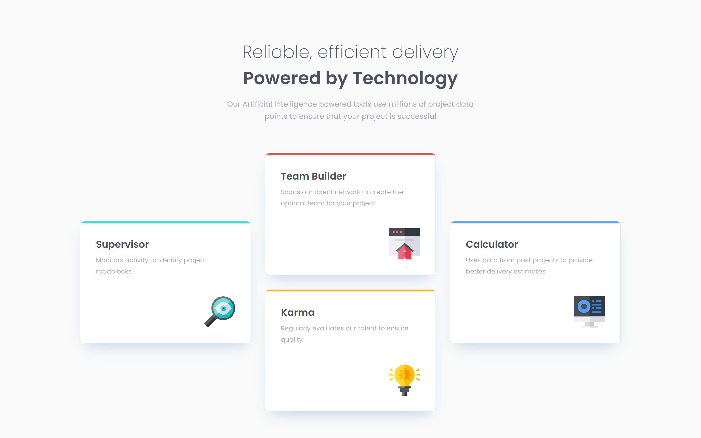
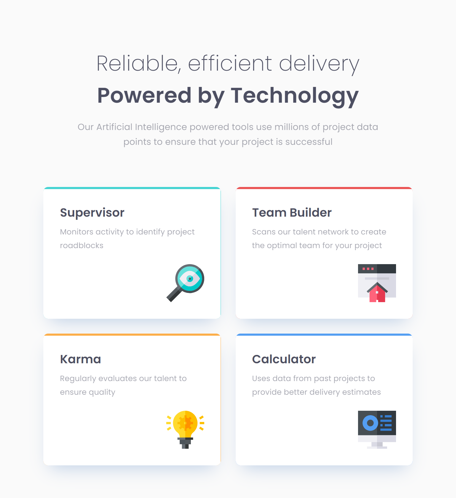
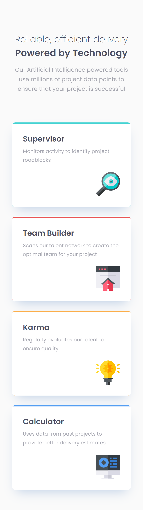

# **Four card feature section solution**

This is a solution to the [challenge on Frontend Mentor](https://www.frontendmentor.io/challenges/four-card-feature-section-weK1eFYK). 

Check out the [live URL](https://ivaberiashvili.github.io/four-card-feature-section/)

## **The challenge**
Users should be able to:
- View the optimal layout for the site depending on their device's screen size

## **The Solution**

**Desktop**

Tablet  |  Mobile
:-------------------------:|:-------------------------:
  |  

### Built with
- Semantic HTML5 markup
- CSS custom properties
- Flexbox
- Grid
- Mobile-first workflow

### What I learned
I further improved my Flexbox and Grid skills and learned how to use clip path.

### Resources
- [Clip path Maker](https://meyerweb.com/eric/tools/css/reset/)
- [Mask mode in CSS](https://css-tricks.com/almanac/properties/m/mask-mode/)

### Author 
- [Iva](https://github.com/ivaberiashvili/)